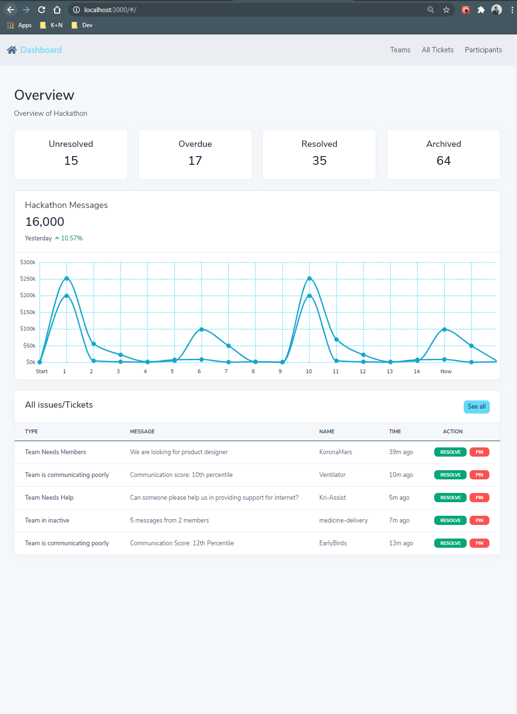

# hackapp-ui

## ReactJS based Front-End application for HackApp Project

### `yarn install`

To install all the required dependencies.

### `yarn start`

Runs the app in the development mode.\
Open [http://localhost:3000](http://localhost:3000) to view it in the browser.

### Current State is as follows:

